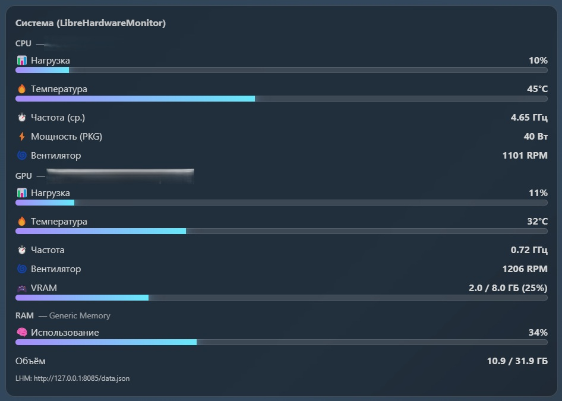
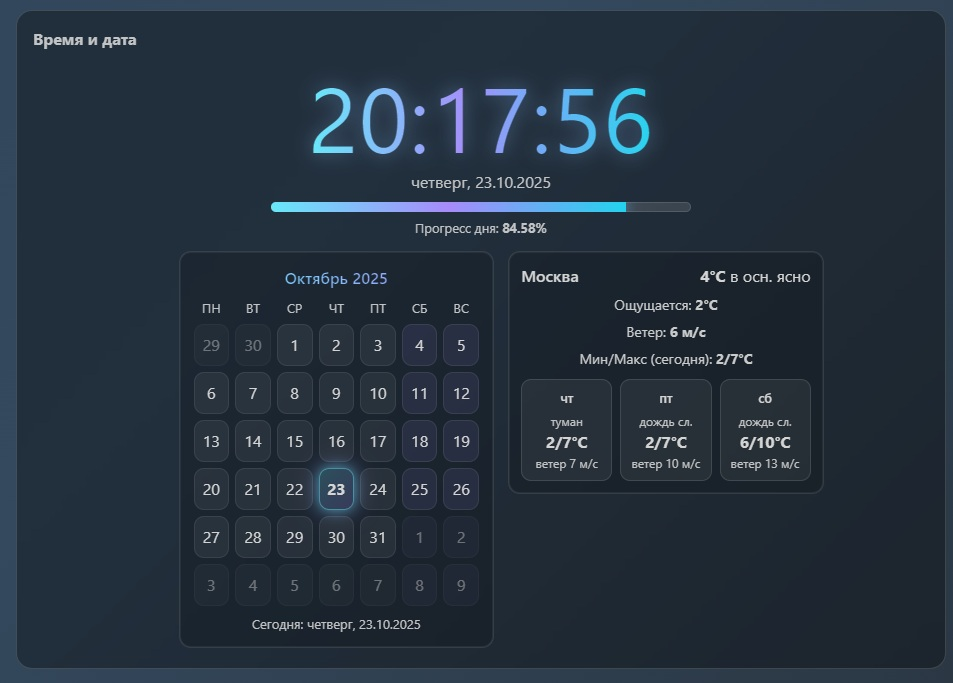

# 🖥️ LHM Dashboard — динамические обои для Wallpaper Engine с интеграцией LibreHardwareMonitor

**LHM Dashboard** — это HTML/JS проект для [Wallpaper Engine](https://store.steampowered.com/app/431960/Wallpaper_Engine/), который отображает красивые анимированные часы, календарь, погоду и системные метрики (CPU, GPU, RAM) через [LibreHardwareMonitor](https://github.com/LibreHardwareMonitor/LibreHardwareMonitor).

---

## ✨ Возможности

- 🕒 **Электронные часы** с прогрессом дня  
- 📅 **Календарь** текущего месяца  
- ☀️ **Погода (Москва)** с 3-дневным прогнозом через [Open-Meteo API](https://open-meteo.com)  
- ⚙️ **Интеграция с LibreHardwareMonitor** — отображает:
  - нагрузку, температуру, частоту, мощность и обороты CPU  
  - загрузку, температуру, частоту и вентиляторы GPU  
  - использование RAM и VRAM  
- 🌗 **Переключение темы** (светлая / тёмная)  
- 💡 Полностью автономный интерфейс — без сторонних ключей API

---

## 🧩 Структура проекта

```
📁 LHM Dashboard
├── LHM Dashboard.html   # Основной HTML-файл
├── styles.css          # Стили, оформление и анимации
├── script.js          # Логика интерфейса и API
├── README.md         # Документация проекта
├── screenshots/       # Скриншоты для документации
│   ├── lhm-panel.jpg
│   └── weather-calendar.jpg
└── README.md         # Документация проекта
```


---

## ⚙️ Установка и настройка

### Вариант 1. Через Wallpaper Engine

1. Откройте Wallpaper Engine → Рекдактор обоев → Создать обои  → выберите **HTML проект**  
2. Настройте обновление данных LibreHardwareMonitor (см. ниже)


---

## 🧠 Интеграция с LibreHardwareMonitor

1. Запустите **LibreHardwareMonitor.exe**  
2. В меню выберите **Options → Remote Web Server → Run**  
3. Убедитесь, что сервер доступен по адресу, например:
http://localhost:8085/data.json
4. Обои автоматически найдут доступный порт (8085, 8086 или 8888)

💬 При успешном подключении внизу панели появится строка:
LHM: http://localhost:8085/data.json

# Поменять локацию для погоды
Чтобы изменить город, для которого показывается погода, используйте координаты и название одного из городов‑миллионников России:

| Город         | Координаты (lat, lon)         | Временная зона (IANA)         |
|---------------|------------------------------|-------------------------------|
| Москва        | 55.7558, 37.6173             | Europe/Moscow                 |
| Санкт-Петербург | 59.9343, 30.3351           | Europe/Moscow                 |
| Новосибирск   | 55.0084, 82.9357             | Asia/Novosibirsk              |
| Екатеринбург  | 56.8389, 60.6057             | Asia/Yekaterinburg            |
| Казань        | 55.8304, 49.0661             | Europe/Moscow                 |
| Нижний Новгород | 56.3269, 44.0059           | Europe/Moscow                 |
| Челябинск     | 55.1644, 61.4368             | Asia/Yekaterinburg            |
| Самара        | 53.1959, 50.1007             | Europe/Samara                 |
| Омск          | 54.9885, 73.3242             | Asia/Omsk                     |
| Ростов-на-Дону| 47.2357, 39.7015             | Europe/Moscow                 |
| Уфа           | 54.7387, 55.9721             | Asia/Yekaterinburg            |
| Красноярск    | 56.0153, 92.8932             | Asia/Krasnoyarsk              |
| Пермь         | 58.0105, 56.2502             | Asia/Yekaterinburg            |
| Воронеж       | 51.6755, 39.2089             | Europe/Moscow                 |
| Волгоград     | 48.7071, 44.5160             | Europe/Volgograd              |

**Пример:**  
В файле `script.js` замените строку на координаты нужного города, например для Екатеринбурга:
```js
const MOSCOW = { lat: 56.8389, lon: 60.6057 }; // Екатеринбург
```
В `LHM Dashboard.html` замените название города:
```html
<span class="w-city">Екатеринбург</span>
```
И, при необходимости, измените временную зону в URL:
```
&timezone=Asia%2FYekaterinburg
```


---

## 📸 Скриншоты

| Метрики LHM | Погода и календарь |
|--------------|--------------------|
|  |  |

---

## 🔧 Технические детали

- Язык интерфейса: **Русский**
- API погоды: [Open-Meteo (без ключей)](https://open-meteo.com)
- Бэкенд мониторинга: [LibreHardwareMonitor](https://github.com/LibreHardwareMonitor/LibreHardwareMonitor)
- Совместимость: **Wallpaper Engine (Windows)**

---

## 📜 Лицензия

Этот проект распространяется под лицензией **MIT**.  
Вы можете свободно изменять и использовать его для личных или коммерческих целей.

---

## 💬 Автор

**LHM Dashboard by Kirito0098**  
Если проект понравился — поставьте ⭐ на GitHub ❤️

---

